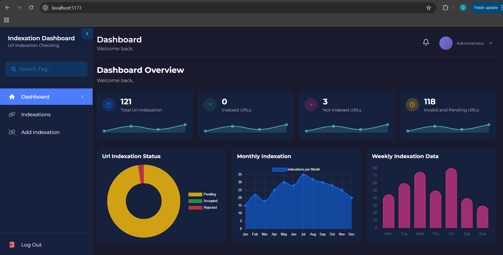
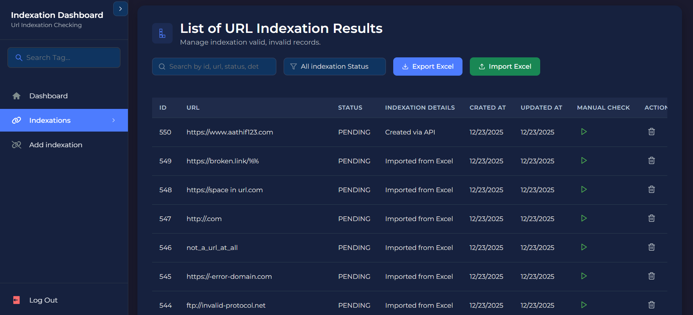
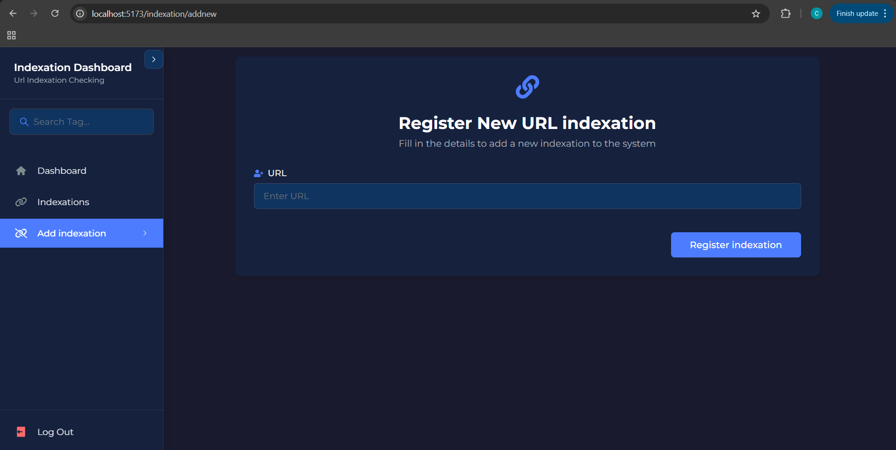

# URL Indexation Checker Dashboard (Frontend)

This is the interactive React-based frontend for the **URL Indexation Checker Dashboard**. It provides a real-time interface to manage, visualize, and trigger indexation checks for websites, ensuring data transparency through advanced analytics. The application features a fully responsive design, optimized for seamless performance across desktop web, tablet, and mobile devices.


---

## 🛠 Tech Stack

* **Framework**: React.js (Vite)
* **Charts**: Chart.js / React-Chartjs-2 (Data Visualization)
* **Icons**: React Icons (Fi, Md, Io sets)
* **State Management**: React Hooks (useState, useEffect)
* **API Client**: Axios (Centralized API handling)
* **Notifications**: React Hot Toast

---

## 🏗 Project Structure

The frontend is organized into logical directories to separate UI components from business logic and API configurations.

* **`src/components`**: Contains reusable UI components and the main view layouts.
* **`src/api`**: Centralized API service modules for Auth, Admin, and Indexation logic. 
* **`src/assets`**: Static images and global styles.
* **`src/config`**: Global frontend configuration settings.
* **`public/`**: Stores static assets like the sample Excel data file. 

---

## 🖥 Dashboard View & Functionalities

### **1. Dashboard Overview**

The primary landing page provides a high-level summary of the system's current state.

* **Metric Cards**: Displays real-time counts for **Total URL Indexation**, **Indexed URLs**, **Not Indexed URLs**, and **Invalid/Pending URLs**. 

* **Visual Analytics**:
* **URL Indexation Status**: A Doughnut chart visualizing the breakdown of URL statuses. 

* **Monthly Indexation**: A Line chart showing long-term trends (partially mocked for visualization). 

* **Weekly Indexation Data**: A Bar chart displaying activity frequency over the current week. (partially mocked for visualization). 




### **2. Indexations Management**

A comprehensive interface to manage and audit specific URL records.

* **Summary Stats**: Dedicated cards for **Accepted**, **Rejected**, and **Pending** counts. 

* **Advanced Filtering**: Users can search by **ID**, **URL**, **Status**, or **Update Time**. 

* **Status Filter**: Dropdown to filter results by **All**, **Pending**, **Indexed**, **Not Indexed**, or **Invalid**. 

* **Bulk Operations**:
* **Import Excel**: Upload a sheet with up to **30 records** to seed the system. 

* **Export Excel**: Download the current results for offline reporting. 

* **Table Actions**: Each record supports a **Manual Re-run** (Play icon) and **Delete** action. 

* **Real-time Analytics Summary**: Displays the **Top Indexation Performance** and **Weekly Status** using real data fetched from the PostgreSQL backend. 



### **3. Add New Indexation**

A dedicated page to register individual URLs into the monitoring system in real-time.

* **Single URL Registration**: A streamlined form to add new entries without needing an Excel upload. 

* **Validation**: Built-in logic to ensure URLs follow the correct protocol before submission. 



---

## ⚙️ Setup & Installation

1. **Enter the frontend directory**:
```bash
$ cd react.indexation.checker

```


2. **Install dependencies**:
```bash
$ npm install

```


3. **Configure API URL**:
Ensure the `config.js` or `.env` file points to the backend (typically `http://localhost:4000/api/v1`).

4. **Run the Application**:
```bash
$ npm run dev

```


Once the application is running, the dashboard is accessible at:

> **Access URL**: [http://localhost:5173/](https://www.google.com/search?q=http://localhost:5173/)

---

## 📊 Sample Data Requirement

The system is designed to handle the specific sample data requirements provided in the assignment:

*  **10 Indexed URLs** (Green Status) 


*  **10 Not Indexed URLs** (Red Status) 


*  **10 Fake/Invalid URLs** (Grey Status) 


The pre-configured file `Sample Data Url Checker.xlsx` is available in the **public folder** of the backend project for testing these categories. 
